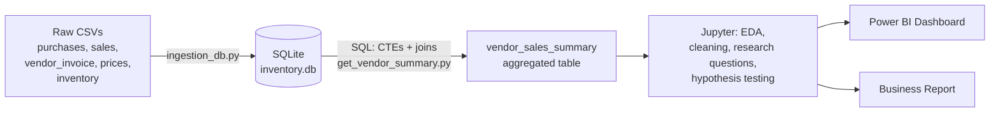

[README.md](https://github.com/user-attachments/files/29936660/README.md)

# Vendor Performance Analysis — SQL + Python + Power BI

End-to-end data analytics project analyzing vendor and brand performance for a retail/wholesale liquor distributor. Raw transactional data (~multi-million-row purchase and sales tables) is ingested into a SQLite database, aggregated with SQL, analyzed in Python (EDA, statistical testing), visualized in a Power BI dashboard, and summarized in a business report.

## Business Problem

Effective inventory and sales management are critical for profitability in retail and wholesale. The company needs to ensure it is not losing money through inefficient pricing, poor inventory turnover, or vendor dependency. This analysis aims to:

- Identify underperforming brands that need promotional or pricing adjustments
- Determine top vendors contributing to sales and gross profit
- Analyze the impact of bulk purchasing on unit costs
- Assess inventory turnover to reduce holding costs and improve efficiency
- Investigate the profitability variance between high-performing and low-performing vendors

## Tech Stack

| Layer | Tools |
|---|---|
| Database | SQLite (via SQLAlchemy) |
| ETL / Aggregation | Python, Pandas, SQL (CTEs, joins, aggregations) |
| Analysis | Jupyter, Pandas, Matplotlib, Seaborn, SciPy (hypothesis testing) |
| Dashboard | Power BI |
| Ops | Python `logging` for pipeline monitoring |

## Pipeline



1. **Ingestion** — `ingestion_db.py` loops over every CSV in `data/` and writes each one to SQLite as a table (filename = table name), with timing and status written to `logs/`.
2. **Aggregation** — `get_vendor_summary.py` merges purchases, purchase prices, sales, and freight data into one vendor/brand-level summary table using a CTE-based SQL query, then adds derived metrics (GrossProfit, ProfitMargin, StockTurnover, SalesToPurchaseRatio) and writes the result back into the database.
3. **Analysis** — `Exploratory_Data_Analysis.ipynb` explores the raw tables and develops the aggregation logic; `Vendor_Performance_Analysis.ipynb` loads the summary table, cleans/filters it, answers the research questions, and validates findings with a two-sample t-test.
4. **Reporting** — Power BI dashboard (`dashboard/`) and written report (`report/`) communicate the findings.

## Project Structure

```
├── data/                              # Raw CSVs (not tracked — see Data note)
├── logs/                              # Pipeline logs (not tracked)
├── ingestion_db.py                    # CSV → SQLite ingestion script
├── get_vendor_summary.py              # SQL aggregation + feature engineering → summary table
├── Exploratory_Data_Analysis.ipynb    # Table exploration, query development
├── Vendor_Performance_Analysis.ipynb  # Research questions, statistics, visualizations
├── vendor_sales_summary.csv           # Final aggregated dataset (vendor × brand grain)
├── dashboard/vendor_performance.pbix  # Power BI dashboard
├── report/Vendor_Performance_Report.pdf
└── images/                            # Dashboard screenshots
```

## Key Insights

- **198 brands** show low sales but high profit margins — candidates for targeted promotions or price optimization to grow volume without sacrificing profitability.
- **Vendor dependency risk:** the top 10 vendors account for **65.69%** of total purchase dollars; the remaining vendors contribute only 34.31%, signaling a need for supplier diversification.
- **Bulk purchasing pays off:** large orders achieve a unit cost of **$10.78**, roughly **72% lower** than small orders — clear evidence that bulk pricing drives cost efficiency.
- **$2.71M is locked in unsold inventory**, concentrated among vendors with low stock turnover — a direct target for purchase-quantity adjustments and clearance strategies.
- **Profitability models differ significantly:** top-selling vendors average a **31.17%** profit margin (95% CI: 30.74–31.61) vs. **41.55%** (95% CI: 40.48–42.62) for low-performing vendors. A two-sample t-test rejects the null hypothesis — high-volume vendors compete on price, while low-volume vendors rely on premium margins.

## Dashboard


## How to Run

```bash
pip install -r requirements.txt

# 1. Place the raw CSVs in data/ then build the database
python ingestion_db.py

# 2. Build the aggregated vendor summary table
python get_vendor_summary.py

# 3. Explore the analysis
jupyter notebook Vendor_Performance_Analysis.ipynb
```

## Data

The raw dataset (purchases, sales, purchase prices, vendor invoices, beginning/ending inventory) totals several GB and is excluded from the repository. The final aggregated output (`vendor_sales_summary.csv`, ~10.7k vendor × brand rows) is included so the analysis notebooks and dashboard can be reproduced without the raw files.

## Final Recommendations

- Re-evaluate pricing for low-sales, high-margin brands to boost volume without hurting profitability
- Diversify vendor partnerships to reduce dependency on a few suppliers
- Leverage bulk purchasing advantages to maintain competitive pricing
- Optimize slow-moving inventory through adjusted purchase quantities and clearance sales
- Strengthen marketing/distribution for low-performing vendors to lift sales volumes
