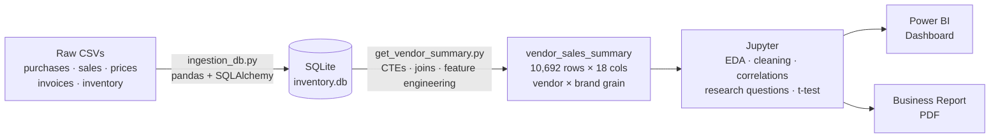

# Vendor Performance Analysis
### An end-to-end retail analytics pipeline — SQL · Python · Power BI


---

## Table of Contents

- [Overview](#overview)
- [Business Problem](#business-problem)
- [The Dataset](#the-dataset)
- [Architecture & Pipeline](#architecture--pipeline)
- [Repository Structure](#repository-structure)
- [Methodology](#methodology)
- [Engineered Metrics](#engineered-metrics)
- [Key Analytical Decisions](#key-analytical-decisions)
- [Key Findings](#key-findings)
- [Statistical Validation](#statistical-validation)
- [Dashboard](#dashboard)
- [Business Recommendations](#business-recommendations)
- [How to Run](#how-to-run)
- [Limitations & Future Work](#limitations--future-work)

---

## Overview

This project analyses vendor and brand performance for a **wine & spirits wholesale distributor**, turning raw transactional records into decisions a procurement team can actually act on: which suppliers to lean on, which to diversify away from, which products to promote, and where working capital is quietly trapped in dead stock.

The raw data arrives as six transaction-level CSV extracts — purchases, sales, purchase prices, vendor invoices, and opening/closing inventory snapshots — far too large to open in a spreadsheet and awkward to hold in memory in pandas. Rather than fight that, the project follows the shape a real analytics team would use:

> **Ingest → Aggregate in SQL → Analyse in Python → Visualise in Power BI → Recommend**

A Python ingestion script loads every CSV into a **SQLite** database. A **CTE-based SQL query** then collapses millions of transaction rows into a single, analysis-ready fact table at **vendor × brand grain (10,692 rows × 18 columns)**, enriched with engineered profitability metrics. From there, a Jupyter notebook handles exploratory analysis, data-quality filtering, correlation analysis and **hypothesis testing**, and the findings are published as an interactive **Power BI dashboard** and a written business report.

The headline result is a counterintuitive one: **the distributor's lowest-selling vendors carry the *highest* profit margins** — a gap that survives a formal significance test — which means the fix for underperformers is reach and distribution, not price cuts.

---

## Business Problem

Effective inventory and sales management are critical to profitability in retail and wholesale. Margins are thin, capital sits on shelves, and supplier relationships quietly concentrate over time. The company needed to know whether it was losing money through **inefficient pricing, poor inventory turnover, or vendor dependency**.

Five questions framed the analysis:

1. **Which brands are underperforming** and need promotional or pricing adjustments?
2. **Which vendors dominate** sales and gross profit — and how exposed is the business to them?
3. **Does bulk purchasing actually reduce unit cost**, and by how much?
4. **Where is inventory turning over too slowly**, and what is that costing in tied-up capital?
5. **Do high- and low-performing vendors differ in profitability** — and is that difference statistically real, or just noise?

---

## The Dataset

Six raw transaction-level tables. The `sales` table alone runs to millions of rows, and is the reason the aggregation is pushed down into SQL rather than done in pandas.

| Table | Grain (one row = ...) | Key fields used |
|---|---|---|
| `purchases` | A single purchase-order line | VendorNumber, VendorName, Brand, Description, PurchasePrice, Quantity, Dollars |
| `purchase_prices` | A product and its pricing | Brand, Price *(retail)*, Volume, PurchasePrice |
| `sales` | A single sales transaction line | VendorNo, Brand, SalesQuantity, SalesDollars, SalesPrice, ExciseTax |
| `vendor_invoice` | One invoice from a vendor | VendorNumber, Freight, Dollars, Quantity |
| `begin_inventory` | Stock snapshot, start of period | Brand, onHand, Price |
| `end_inventory` | Stock snapshot, end of period | Brand, onHand, Price |

**Domain notes that matter for interpretation:**

- `Brand` is a **numeric product ID**, not a marketing brand name — the human-readable name lives in `Description`.
- `PurchasePrice` is the **cost paid to the vendor per unit**; `Price` in `purchase_prices` (aliased `ActualPrice`) is the **retail selling price**.
- `ExciseTax` appears because alcohol is a regulated, per-unit-taxed product — it is a genuine cost component of sales.
- Freight is recorded only at **invoice/vendor level**, never per product — which directly shapes how the SQL is structured.

---

## Architecture & Pipeline



**Why this architecture rather than one large pandas script?**

- **Scale.** The raw extracts do not fit comfortably in memory. SQLite performs the grouping and joining on disk, and only the aggregated result is ever loaded into pandas.
- **A single source of truth.** Once the summary table exists in the database, the notebook, the dashboard and the report all read the *same* numbers. No drifting copies.
- **Reproducibility.** Exploration happens in notebooks; finalised logic is frozen into logged, re-runnable `.py` scripts. Both pipeline stages write to `logs/`, so every run is auditable — what ran, when, how long it took, and where it failed.

---

## Repository Structure

```
vendor-performance-analysis/
├── ingestion_db.py                    # Stage 1 — loads all CSVs from data/ into SQLite
├── get_vendor_summary.py              # Stage 2 — SQL aggregation + feature engineering
├── Exploratory_Data_Analysis.ipynb    # Table exploration; where the SQL was developed
├── Vendor_Performance_Analysis.ipynb  # EDA, filtering, research questions, hypothesis test
├── vendor_sales_summary.csv           # Final analysis-ready dataset (10,692 rows)
├── dashboard/
│   └── vendor_performance.pbix        # Power BI dashboard
├── report/
│   └── Vendor_Performance_Report.pdf  # Written business report
├── images/
│   └── dashboard.png                  # Dashboard preview
├── data/                              # Raw CSVs — gitignored (multi-GB)
├── logs/                              # Pipeline run logs — gitignored
└── requirements.txt
```

---

## Methodology

### 1. Ingestion — `ingestion_db.py`

Iterates over every CSV in `data/`, reads it with pandas, and writes it to `inventory.db` through a SQLAlchemy engine, using the filename as the table name. `if_exists='replace'` makes the job **idempotent** — a re-run rebuilds cleanly instead of duplicating rows. Runtime and per-table status are written to `logs/ingestion_db.log`.

### 2. Aggregation — `get_vendor_summary.py`

The analytical heart of the project: a single SQL query built from **three CTEs**.

- **`FreightSummary`** — total freight per vendor, from `vendor_invoice`. Kept separate because vendor level is the only grain freight exists at.
- **`PurchaseSummary`** — `purchases` joined to `purchase_prices` on `Brand`, filtered to `PurchasePrice > 0` (removing invalid/zero-cost records), aggregated to **vendor × brand**: total purchase quantity and dollars, plus retail price and bottle volume.
- **`SalesSummary`** — `sales` aggregated to the same **vendor × brand** grain: sales quantity, sales dollars, sales price and excise tax.

These are `LEFT JOIN`ed into the final `vendor_sales_summary` table, which is then cleaned (`fillna(0)`, whitespace stripped from vendor and product names, `Volume` cast to float), enriched with four derived metrics, and written back into the database.

### 3. Exploratory analysis — `Vendor_Performance_Analysis.ipynb`

Summary statistics and distribution plots surfaced several genuine data-quality problems — each of which turned out to be a finding in its own right:

| Symptom | Root cause | Handling |
|---|---|---|
| `GrossProfit` as low as **−$52,002.78** | Sold below cost, or bought and never sold | Excluded from the margin analysis; analysed separately as loss / dead stock |
| `ProfitMargin` of **−∞** | Division by zero revenue (`SalesDollars = 0`) | Filtered out — margin is undefined without revenue |
| `TotalSalesQuantity = 0` | Purchased but never sold | Deliberately retained — this *is* the dead-stock finding |
| `StockTurnover` up to **274.5** | Sales fulfilled from stock bought in a prior period | Interpreted, not "corrected" — values above 1 are legitimate |
| Extreme skew (`FreightCost` $0.09 → $257,032; `PurchasePrice` mean $24 vs max $5,682) | Bulk logistics, and a premium-product long tail | Retained; medians and grouped comparisons used alongside means |

The analysis set was then filtered to `GrossProfit > 0`, `ProfitMargin > 0`, `TotalSalesQuantity > 0` — restricting the *margin-structure* comparison to profitable, functioning vendor relationships, while the excluded rows were quantified separately rather than discarded.

### 4. Statistical analysis

Correlation matrix, quantile-based segmentation of vendors and brands, 95% confidence intervals on group means, and a **two-sample t-test** confirming the headline margin difference is real.

### 5. Communication

A Power BI dashboard for ongoing operational monitoring, and a written PDF report for one-off leadership decision-making.

---

## Engineered Metrics

| Metric | Formula | What it tells you |
|---|---|---|
| **GrossProfit** | `TotalSalesDollars − TotalPurchaseDollars` | Absolute money made on a product, before overheads |
| **ProfitMargin** | `GrossProfit / TotalSalesDollars × 100` | Profitability per dollar of revenue — comparable across products of any size |
| **StockTurnover** | `TotalSalesQuantity / TotalPurchaseQuantity` | How efficiently purchases convert into sales. Below 1 = stock accumulating; above 1 = selling down older inventory |
| **SalesToPurchaseRatio** | `TotalSalesDollars / TotalPurchaseDollars` | Dollar-for-dollar return on procurement spend |

---

## Key Analytical Decisions

The two design choices that most determine whether the numbers are trustworthy:

**1. Aggregate *inside* the CTEs, before joining.**
`purchases` and `sales` are both **transaction-grain** tables. Joining them raw on vendor + brand would produce a many-to-many fan-out — every purchase row paired against every sales row for the same product — inflating quantities and double-counting dollars, on top of generating an enormous intermediate result. Pre-aggregating each side to vendor × brand makes the join effectively one-to-one: correct *and* fast.

**2. `LEFT JOIN`, not `INNER JOIN`.**
Products that were purchased but **never sold** have no matching rows in `SalesSummary`. An inner join would silently delete them — and those are exactly the records the business most needs to see. The `LEFT JOIN` preserves them with NULL sales, which `clean_data()` fills with 0 (the *true* value, not an imputed guess). That single decision is what makes the **$2.71M of unsold inventory** visible at all.

---

## Key Findings

### 1. 198 brands are profitable but invisible

198 products combine **low sales volume with high profit margins** — several clearing under $600 in total sales while returning 65–90% margins. These are not failures; they are under-marketed. Targeted promotion or modest price optimisation could grow volume without eroding the very margin that makes them attractive.

### 2. Severe vendor concentration — 65.69% of spend sits with 10 suppliers

The **top 10 vendors account for 65.69% of total purchase dollars**; every other vendor combined accounts for just 34.31%. Diageo alone represents 16.3%, followed by Martignetti (8.3%), Pernod Ricard (7.8%) and Jim Beam (7.6%). This is **supply-chain risk with no corresponding upside**: a disruption, price rise or contract dispute at one or two suppliers would hit two-thirds of procurement.

### 3. Bulk purchasing cuts unit cost by ~72%

Segmenting orders by size reveals a steep and consistent discount curve:

| Order size | Average unit purchase price |
|---|---|
| Small | **$39.06** |
| Medium | **$15.49** |
| Large | **$10.78** |

Large orders cost roughly **72% less per unit** than small ones — strong evidence that consolidating fragmented small orders is one of the cheapest margin levers available.

### 4. $2.71M is frozen in unsold inventory

Vendors with `StockTurnover < 1` are buying faster than they sell. Valuing the unsold units at purchase cost puts **$2.71M of working capital sitting on shelves**. The worst turnover ratios belong to smaller vendors (0.62–0.82), but the largest *dollar* exposure sits with the giants — Diageo ($722K), Jim Beam ($555K), Pernod Ricard ($471K) — because scale magnifies even a small imbalance. Slow-moving stock raises holding costs, ties up cash, and drags on overall profitability.

### 5. The counterintuitive one: weaker vendors have *stronger* margins

| Vendor group | Mean profit margin | 95% confidence interval |
|---|---|---|
| **Top-performing** (high sales) | **31.17%** | 30.74% – 31.61% |
| **Low-performing** (low sales) | **41.55%** | 40.48% – 42.62% |

The intervals **do not overlap**. Low-performing vendors are not selling cheaply and losing money — they are **premium, niche players**: high margin, low volume. Top performers run the opposite model, a volume game on thinner margins. This inverts the obvious recommendation. Low performers don't need price cuts; they need **distribution and marketing reach**. Top performers don't need higher prices; they need **cost efficiency**.

### 6. What the correlations do — and don't — say

- `TotalPurchaseQuantity` ↔ `TotalSalesQuantity` = **0.999**. Procurement tracks demand almost perfectly *in aggregate*, which is precisely why the product-level dead stock in finding #4 is so easy to miss.
- `PurchasePrice` ↔ `SalesDollars` / `GrossProfit` ≈ **−0.01**. A product's price level says essentially nothing about how much revenue or profit it generates.
- `ProfitMargin` ↔ `TotalSalesPrice` = **−0.179**. Higher-priced sales trend towards slightly thinner margins — consistent with competitive pricing pressure at the top end.
- `StockTurnover` ↔ `GrossProfit` = **−0.038**. **Fast-moving does not mean profitable.** Volume and margin are separate levers, and must be managed separately.

---

## Statistical Validation

To confirm that the margin gap in finding #5 is not an artefact of sampling:

- **H₀ (null):** no difference in mean profit margin between top- and low-performing vendors.
- **H₁ (alternative):** a difference exists.
- **Test:** two-sample t-test (`scipy.stats.ttest_ind`), α = 0.05.
- **Result:** *p* < 0.05 → **reject H₀.**

The two vendor groups genuinely operate under **structurally different profitability models**. This is what elevates the finding from an interesting-looking chart into something a business can safely act on.

---

## Dashboard

Built in Power BI on the aggregated summary table — KPI cards for sales, purchases, gross profit, margin and unsold capital; vendor and brand leaderboards; the purchase-concentration breakdown; and the low-turnover watchlist.


---

## Business Recommendations

1. **Diversify the supplier base.** Reducing the top-10 concentration from 65.69% is cheap insurance against a supply shock the business currently could not absorb.
2. **Promote the 198 high-margin, low-sales brands.** Targeted marketing or small price adjustments grow volume exactly where volume is worth the most.
3. **Consolidate small orders into bulk purchases** wherever turnover supports it, capturing the ~72% per-unit discount.
4. **Release the $2.71M in dead stock** — adjust future purchase quantities, run clearance on the worst offenders, and review storage strategy for slow movers.
5. **Segment the vendor strategy.** High-volume vendors → drive cost efficiency and bundled promotions. High-margin, low-volume vendors → invest in distribution and marketing reach rather than discounting.

---

## How to Run

```bash
# 1. Install dependencies
pip install -r requirements.txt

# 2. Place the raw CSVs in data/ , then build the database
python ingestion_db.py

# 3. Build the aggregated vendor summary table
python get_vendor_summary.py

# 4. Explore the analysis
jupyter notebook Vendor_Performance_Analysis.ipynb
```

> **Note on data:** the raw extracts total several gigabytes and are excluded from this repository. The final aggregated dataset (`vendor_sales_summary.csv`) *is* included, so the analysis notebook and the dashboard can be reproduced without them.

---

## Limitations & Future Work

Being explicit about what this project *doesn't* do:

- **The ingestion is a full reload, not an incremental one.** `if_exists='replace'` is deliberate for a batch rebuild, but a production pipeline would need incremental loads or upserts, plus chunked reading for memory safety.
- **SQLite is a single-analyst choice.** Because the code goes through SQLAlchemy, migrating to PostgreSQL is largely a connection-string change — worth doing the moment more than one person needs concurrent access.
- **Unsold stock is approximated** as purchases minus sales, rather than reconciled against the `begin_inventory` / `end_inventory` snapshots. Reconciling against those tables would tighten the $2.71M figure.
- **The margin comparison excludes loss-making rows by design** — the question was about margin *structure* among viable products. Those rows are quantified separately rather than ignored, but a full P&L view would need them back in.
- **No automated data validation.** Row-count checks after each join, null-rate assertions and schema tests would catch silent breakage before it reaches a dashboard.
- **Correlation is not causation.** The relationships reported here are descriptive; any pricing change should be validated with a controlled test before rollout.

---

**Author:** Sakshamm Gulati · sakshamgulati19@gmail.com
